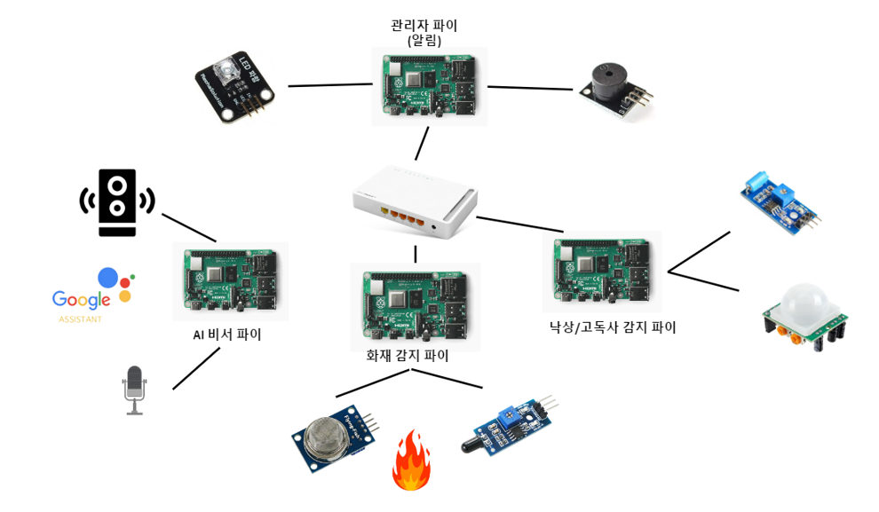

# 👵Friend
2022년 2학기 시스템 프로그래밍 및 실습 Team Project: 독거노인 모니터링 시스템, 벗

## 📢 프로젝트 소개
화재, 낙상 등의 사고와 고독사의 예방을 위해 독거노인의 집을 모니터링하여 사고를 예방하는 시스템입니다. 

## 📆 개발 기간
2022.11.06 ~ 2022.12.23

## ⚙ Hardware



### 1. 화재 감지 파이
- 라즈베리파이
- 불꽃 센서
- 가스 센서

### 2. 낙상 및 모션 감지 파이
- 라즈베리파이
- 진동 센서
- 인체 감지 센서

### 3. Ai 비서 파이
- 라즈베리파이
- 마이크

### 4. 관리자 파이
- 라즈베리파이
- 부저
- LED


## 🔑 Algorithm

두 대의 라즈베리파이는 위험 감지를 위한 센서 측정을 담당하고, 한 대의 라즈베리 파이는 우울감 해소를 위한 AI 비서 서비스를 담당합니다. 나머지 한 대의 라즈베리 파이는 센서 값을 모아서 위험으로 판단된다면 알림을 울립니다.

### 1. 화재 감지 파이
- 불꽃 센서와 가스 센서를 활용해서 화재 여부 판단
- 화재 판단 시 관리자 파이에 "1" 전송
- 1개의 thread 사용
- GPIO 통신 사용

### 2. 낙상 및 모션 감지 파이
- 진동 센서를 활용해서 낙상 여부 판단
- 낙상 위험 판단 시 관리자 파이에 “2” 전송
- vibration thread에서 동작
- GPIO 통신 사용
---
- 인체 감지 센서를 활용해서 고독사 여부 판단
- 고독사 위험 판단 시 관리자 파이에 “3” 전송
- pir thread에서 동작
- SPI 통신 사용

### 3. Ai 비서 파이
- 마이크를 통해 말을 걺
- 구글 어시스턴트가 인공지능을 통해 사용자의 음성을 분석해서 답변을 생성
- 구글 어시스턴트의 답변 출력

### 4. 관리자 파이
- LED를 활용해서 알림 기능 수행
- 클라이언트로부터 위험 알림 값이 수신되면 LED ON
- PWM 통신 사용
---
- 부저를 활용해서 알림 기능 수행
- 클라이언트로부터 위험 알림 값이 수신되면 Buzzer ON
- 화재 감지와 낙상/고독사 감지 음 다르게 출력

## 🔨 Compile

### 1. 관리자 파이
```bash
$ gcc -o manager manager.c -lpthread -lwiringPi
$ ./manager [port1]
$ ./manager [port2]
```

### 2. 화재 감지 파이
```bash
$ gcc -o fire_detector fire_detector.c -lpthread
$ ./fire_detector [server ip addr.] [port1]
```

### 3. 낙상 및 모션 감지 파이
```bash
$ gcc -o fall_motion_detector fall_motion_detector.c -lpthread 
$ ./fall_motion_detector [server ip addr.] [port2]
```

### 4. Ai 비서 파이
```bash
# 구글 어시스턴트 다운로드 및 설정한 후 실행
$ google-assistant-demo --project-id PROJECT_ID --device-model-id DEVICE_MODEL
```
